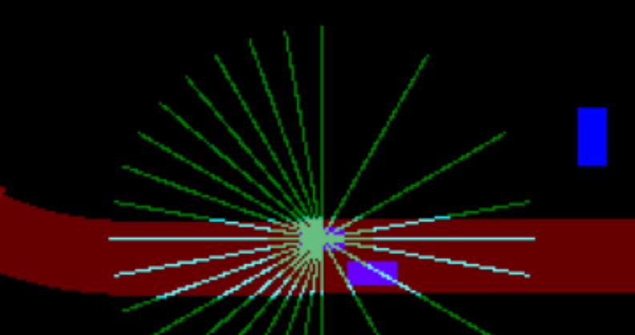

# Local Navigation using RL

## Trained model

<!--  -->
<!--  -->
   

## Static path generation
* **Model**
	* Implemented Actor critic method 
	* The networks are not shared. Both processes data from Conv nets to linear layers
	* Actor outputs in discrete space in which it chooses one of the pre-generated spline curve(polynomial spirals). Each spirals are constained to have zero value for the curvature and its derivative at the end points. This means that any series of spiral choices will produce double differentiable overall curve. The plot below shows the spirals with y vs x displacement
	

* **Environment** 
	* Waypoint stored in carla is used to generate road view of the world(mapGenerator.py)
	* Goal point is chosen randomly in the road ahead
	* Reward of -10 is given if agent crosses boundary, +10 if reaches goal point and the game ends. Small penalty for choosing higher curvature curves.
	* Sparse reward : To deal with this I generated a reward vector(R) at each location on the road that points in the road direction(defined by waypoint) and has magnitude depending on the distance from the center of the lane. Agent is rewarded when it tries to make progress. The reward generated is integral(<R, ds>), where ds is agent displacement vec. Since R magnitude is greatest at center of lane, this means that agent is incentivized to stay in the middle. If this generated reward is negative then agent recieves -10 for moving in opposite direction and game ends.
	* Plot for magnitude of reward vector on a road(lighter means high value). 
	

* **Training**
	* Pixel wise features/embedding is created and fed to ConvNet : features are {cos_yaw, sin_yaw, goal_point, reward_vec_x, reward_vec_y}
	* After giving the entire map at once, the model didn't worked, possibly because of too many parameters. There was also too many straight road examples in the game which was causing it to overfit and only do straight line movements. To deal with this I used
		* Only local 128x128 map window with the player at the center when training. This reduces the number of conv layers and dense layer width.
		* I saved the environment state for trajectories where the model has previously failed. Instead of completely randomly sampling a newgame, now I also sampled and resumed from these failed trajectories which contained more curved road cases.
	* Some Results : Red is start, green is end
	
  

## Dynamic Navigation
### Onpolicy Model
Deriving from the feature representation of the static planner shown above, I added dynamic objects(vehicle and pedestrian) embedding via the GRU network, capturing the time series behavior of the object and helping with the markov assumption. The features is now 128x128x16 spatial embeddings containing information about player, static and dynamic objects stored in individual pixel. Tried [GAIL](https://arxiv.org/pdf/1606.03476.pdf) approach first with expert data collected from carla prebuilt agent but it didn't work because : The computation of double backpropogation graph(for computing Hv) was very slow, even optimized fisher product was struggling with gpu, the support for backprop on gradients is apparently not there for RNN class in pytorch.  
Tried A2C and PPO approach with continious and mixed action. Action space was {steering, throttle, brake, quit} in which quit was binary output used by the agent if it wants to quit the game(reward was then given based on how and where it has parked the vehicle). Time and acceleration penalty was also given. Reward of -10 was given for leaving the road or collision. I faced two main problems with these approaches. The agent regularly gets into deadlock situation and chooses not to move,for example when near the edge of the road it may see that it will get -10 reward in future thus brakes and doesn't move further. Reducing this negative reward and increasing time penalty didn't helped very much as the critic was slow to converge and account for dispersed time penalty. Carla is a heavy simulator, with the on-policy approaches being sample inefficient and hard to parallelize, the training was very slow and had to be abondoned due to limited hardware.

### Offpolicy Model
* **Model**
	* Implemented Soft Actor Critic method(main_sac.py)
	* Action Space : {steering, mixed_throttle_brake}. Instead of having separate independent output node for throttle and brake, mixed_throttle_brake takes continuous value between (-1,1) and is interpreted as brake when < 0 and throttle when > 0 as both being applied at the same time didn't made sense.
	* In order to deal with the deadlock problem encountered earlier I lower-bounded the throttle value to 0.2 when there are no vehicle or pedestrian in near vicinity. This meant changing the "mixed_throttle_brake" value from (-1, 1) to (0.2, 1). In order for model to account for this on/off change in environment response, model was fed extra boolean {0,1} input before outputing "mixed_throttle_brake" value, helping with the MDP assumption. This forced shorter trajectory duration and greater exploration hence speeding up the learning.
	* To reduce the number of parameters, instead of giving full spatial feature map, the features now contain only 26 locational embeddings coming from intersection between road edge and Rays(which can be interpreted as 2D lidar with range of 20meter). This feature contains {distance, rel velocity} of the intersection point.
	* In order to further reduce the number of parameters I used bidirectional RNN to encode the all dynamic object's features which is intersected by the all the rays into fixed 128 dimentional sized vector. Each ray has its own Positional embedding which is concatenated with dynamic object's features such as distance, speed, acceleration in the frame of the agent before RNN encoding. 
	* Doing these changes meant getting rid of costly convolution networks. This made the model into simple dense network with 2 output node, hence reducing total parameters from 1.5M to 140K.
	* Representation(not input) of Rays in 2D space. Dark red is the road, Light red is the destination. Other cars are blue.
	
  

* **Environment**
	* To speed up the training in costly environment I used parallel data collection. In this atmost 10 agents were initialized and collected data in parallel in every environment step. To ensure multiple agents don't interact with one another when running on the same map, pair wise minimum distance between every node in the road network is accounted for and each agents mission is set so that they maintain a fixed minimum distance with each other. With 10 agents, effective data collection speed is close to 150fps and the cpu becomes the main bottleneck.
	* Reward of -5 for crossing boundaries, -5 for collision and +5 for reaching the goal. Reward vector at each point on the road are also present as before to deal with sparse reward. Negative penalty for jerk and lateral acceleration given to force safe and uniform driving. Negative reward for speed above 60.
	* Steering gain : In order for smoother steering I took exponential average of new and previous steering position 

* **Training** 
	* Automatic temperature adjustment used for stable training and exploration([learned temperature](https://arxiv.org/pdf/1812.05905v2.pdf)) 
	* Emphasizing Recent Experience([ERE](https://arxiv.org/pdf/1906.04009.pdf)) used to boost performance. 
	* The model learned steering quickly but took time to develop trust in throttling. Training graph below. Approx 0.8M environment interaction
	
	

* **Issues and Observation**
	* Agent was quite able to control and avoid going of the road. Properly follows lane.
	* Agent always tries to move towards the rightmost lane. Maybe bacause it doesn't like to stay close to oncoming traffic.
	* Observed overestimation of Q values: Q value got very optimisitic at the start even using SAC pessimistic target and gradient clipping.  It might be the case because the state features look very much similar irrespective of the stage of the mission. Adding road distance to the goal added a differentiating factor but it still took long time to learn some realistic value(look at the training graph). To mitigate this we may use distibutional critic([DistQ](https://arxiv.org/pdf/2001.02811.pdf)). 
	* Apprehensive during overtaking or following very closely(look at "issues" video above): I belive that reward function is not the main issue but since limited number of actors are spawned randomly on the entire map,there is less number of interaction between agent and npc. To mitigate this we may want to add more number of vehicles, pedestrian on the path of the mission. This may lead to better exploration and the agent can learn to overtake.
	* Breaks too late sometimes(look at the "issues" video above). Almost touching the vehicle infront: This might be due to 20m range of observation(Rays). Apart from the suggestion above, increasing the Ray range may help agent to register a vehicle upfront quickly and apply the brakes more uniformly(which is incentivized by the reward function).
	* Wobly motion : Increasing the penalty for lateral and longitudinal accelaration and adding steering gain in the environment saw some success in controlling wobbly steering but it is still not acceptable. Below is the graph for the same trajectory(lateral jerk vs env step) before and after these changes. We may look at some other method for smoother control in RL [like](https://arxiv.org/pdf/2012.06644.pdf). 
	
  
    

