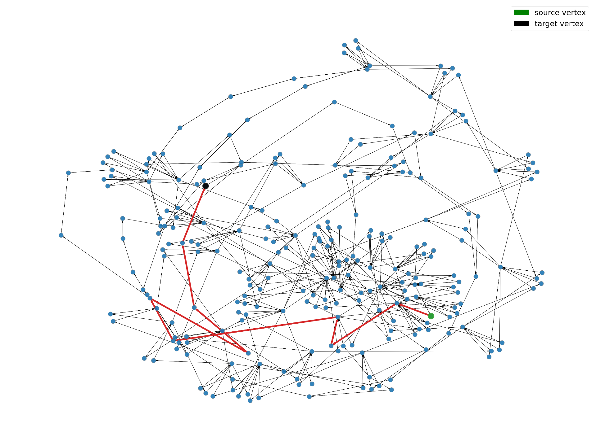

# Perform high level mission planning:
1) Build a graph of road networks for a carla Map
2) Run A* algorithm to find shortest path between two query nodes(road paths)
3) Output the path i.e roadlinks to the lower level planners

visualization of the mission planner output for a query in Town01 map : 

