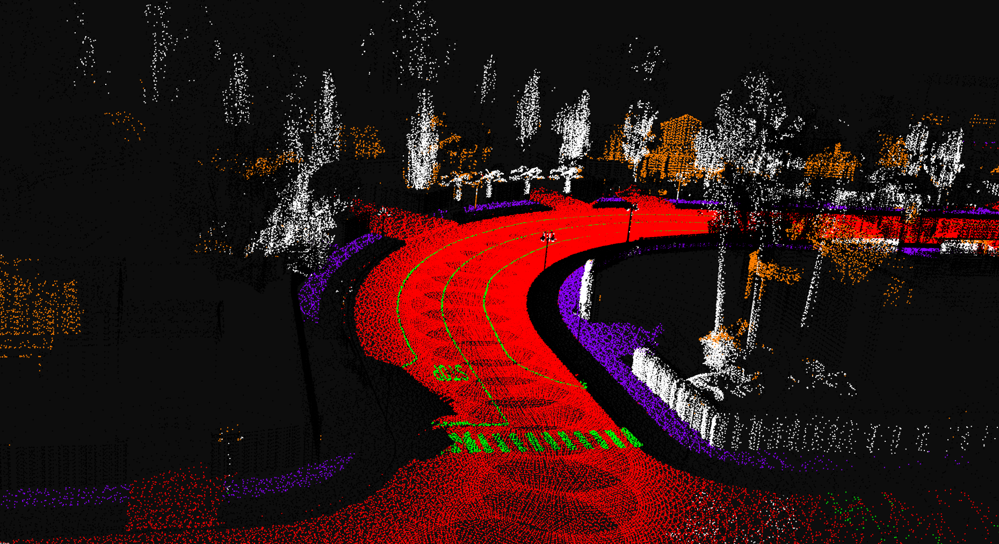
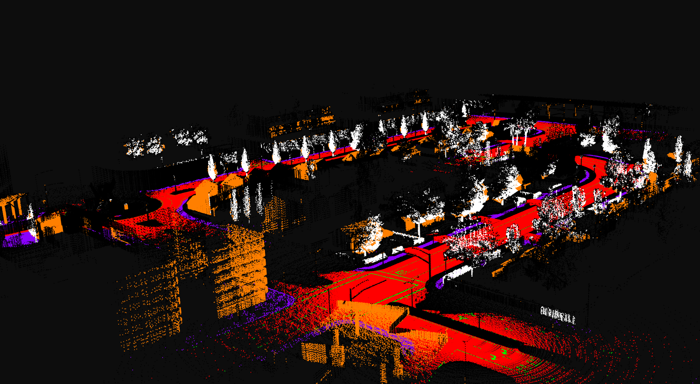
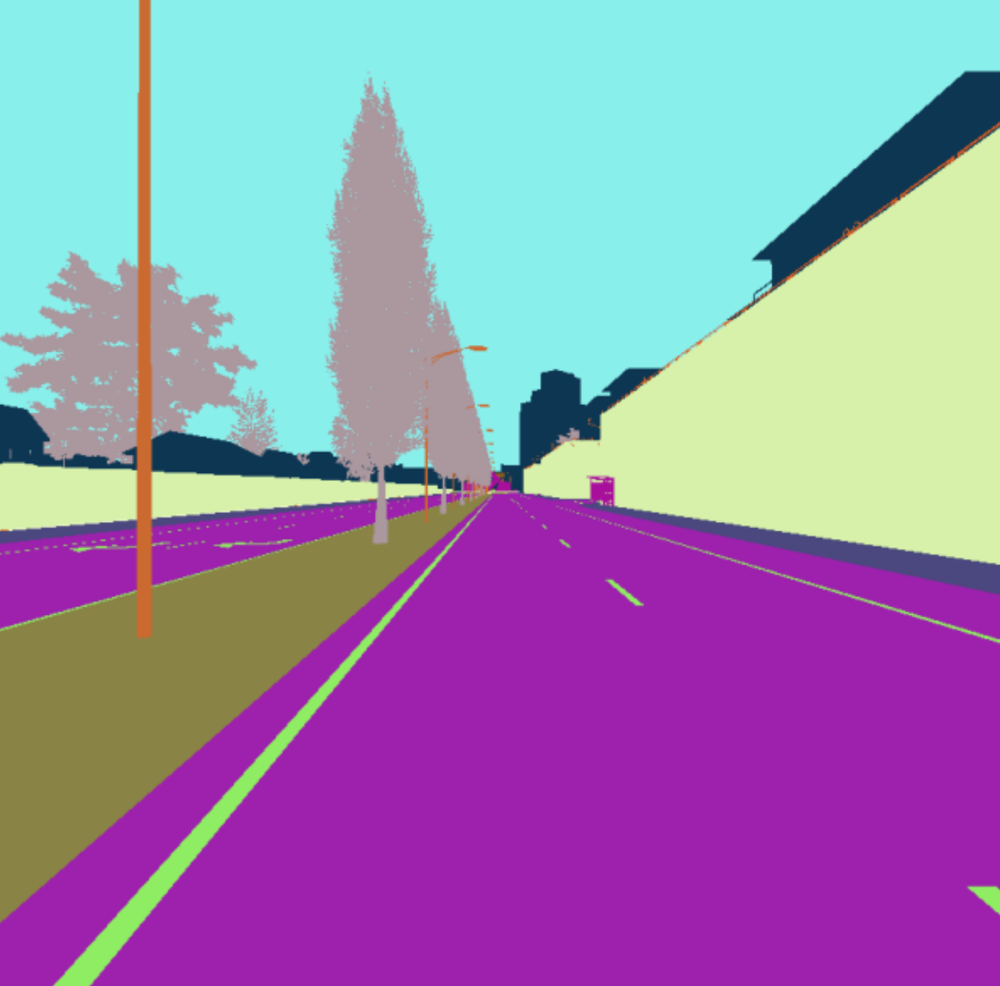
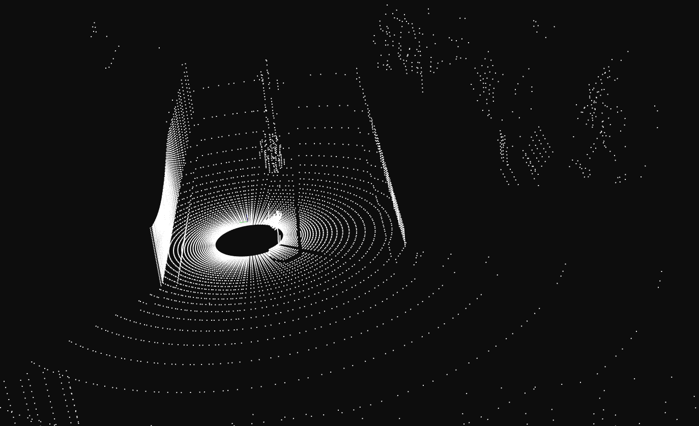
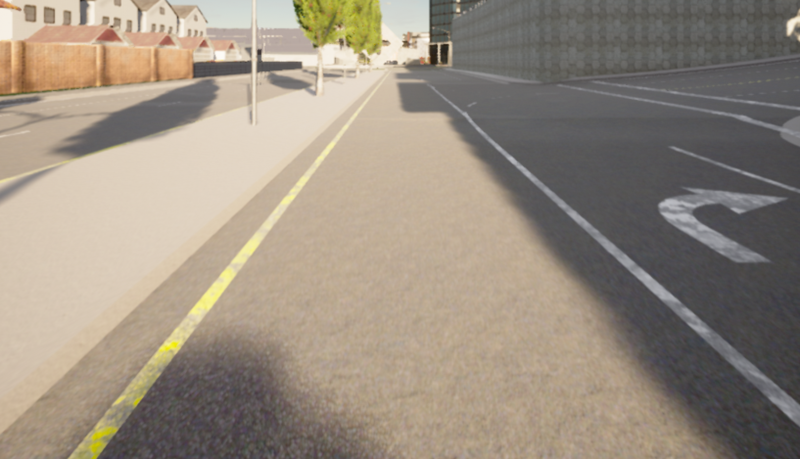
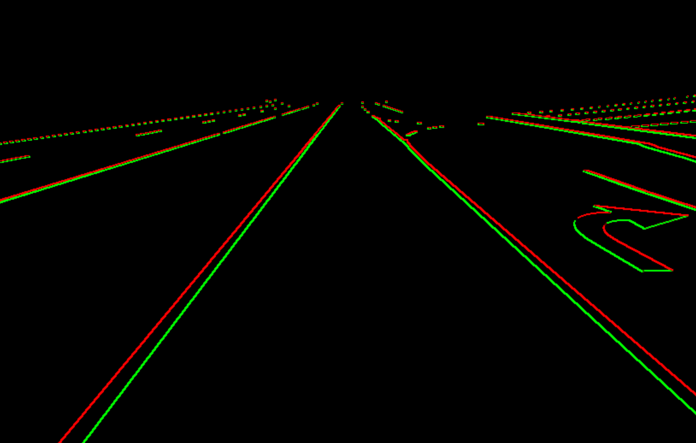

# Mapping and Localization

## Lidar Semantic Segmentation and Mapping

### Generated Lidar Map

* How to Run : [here](https://github.com/harshnehal1996/Self-Driving-Vehicle-With-Carla#to-generate-lidar-map)
* Main Program file : [create_map.cpp](https://github.com/harshnehal1996/Self-Driving-Vehicle-With-Carla/blob/master/perception/feature_extraction_and_mapping/create_map.cpp)

### Target
* Build a static semantic segmentation map from pre segmented images using Lidar, Camera and IMU data
* Extract and store 3D keypoints in this map to enable any agent to localize using Camera

### Things to Consider
1. Program should be efficient enough to deal with large amounts of lidar data points
2. Accuracy of 3D location of the keypoints will affect the localization accuracy within it
3. Accurate procedure to determine the class(road, lane marking, building, sidewalk) of a lidar data point

### Heuristic
#### 1. Data Collection:
I recorded the data which included the point cloud, 2D semantic segmentation, Camera and imu data from Carla(see [data_collection.py](https://github.com/harshnehal1996/Self-Driving-Vehicle-With-Carla/blob/master/data_collection_scripts/perception/localization/collect_trajectory.py))

#### 2. Preprocessing:
1. Used [R2D2](https://github.com/naver/r2d2), which is Deep Learning based method optimized for saliency and repeatability to extract keypoints in an RGB image. This produces list of keypoints and its feature vector for each recorded RGB image.
2. Incase of unsynchronized recorded data, Synchronize by matching the timestamps across sources.
3. Store this synchronized data in keyframes(same as camera-frame containing the 2D semantic segmentation). I stored it in the form of doubly-linked **List**.

#### 3. Projection: 
Since we have the semantic segmentation images we can project lidar points onto to the cameraframe to find its class.

In order to keep the overall complexity O(num lidar points), projecting every lidar point to every cameraframe must be avoided. To make it efficient I did two things
1. Parallelized the entire operation across multiple cores using openmp.
2. Only project to the cameraframes that are nearby to the lidar point.
In order to achieve this, before projecting a lidar point, first the nearest cameraframe(**K**) to the point is searched in the linked-list. Then the point is only projected to the cameraframes that are less than 40m away from "K". 

#### 3. Segmentation: 
Each lidar points has to be classified amoung fixed number of classes. For this we score the point based on many different projections. In the previous step let say the lidar point(**P**) was projected in N different camera frames. From these projection, an inverse distance weighted  score is formed for all different types of semantic classes. Thus if in the "ith" projection of "P", the class was "j" then the "jth" class gets 
1 / (distance of "P" in "i") extra score and all other class gets zero for the "ith" projection. This means we give more weightage to nearby observation than far away which I found out to work well with real-world lane segmentation data where the model confidence decreases the farther the markings are.
The class of lidar point becomes the argmax of its class scores.

To improve accuracy further two other factors were considered.
1. **See-through projection elimination**: 
	* Since lidar points are directly projected onto the cameraframes without any regards to its visibility this means that lidar points behind any opaque objects can still show up in the projection. To eliminate these projections I do the following. *Execute Parallelly*:
		1. Divide the cameraframe in small *sized* 2D voxels(size depend on projected points density inside the voxel)
		2. I assume that the lowest distance projection point(**P**) in the voxel is visible in the cameraframe.
		3. Perform a **DBScan** clustering(based on distance) from just the point "P" to find points that are located closeby in space to P
		4. Eliminate all the other points not part of this cluster

2. **Obscure projection elimination**:
	* Edges can be a tricky case to deal since a slight over-extension of labels around it in the 2D segmentation image can potentially affect large number of lidar points behind it in 3D. You can imagine this by visualizing how fast the shawdow of a sphere on a wall behind it grows in size if we move the sphere a tiny amount towards the light source. To eliminate this I clipped the segmented regions from the outward boundary(having radially outward gradient) of the objects. The gradients/boundary were detected using Sobel filter. Visualization below for semantic class "lane marking". Red is outward boundary(where labels are omitted) and green is the inner boundary(untouched). 
	

	2D Semantic Segmentation data(left) and pcl data(right)

#### 4. Keypoint extraction: 
We need to find 3D location of reliable keypoints in the map. The keypoints were generated in the preprocessing step(**2**). I use both epipolar geometry and lidar data points to find the 3D location of the keypoint. In this way an estimation from both sources can reinforce or reject each other, increasing the reliability of its location. I do the following steps for this. *Execute Parallely*:

1. For a cameraframe(**K**) match keypoints with previous(**P**) and the next(**N**) cameraframe element in the Linked-List
2. Eliminate matching outliers by thresholding its perpendicular distance to the epipolar line
3. For every keypoint in frame "K", use epipolar geometry in frame {"P", "K", "N"} to find a rough 3D location for it
4. Using this 3D location as a prior estimation, perform a DBScan search through the lidar data points near this location to form a cluster of nearby points(**C**).
5. The mean location of this cluster is now assumed to be the location of the keypoint 

#### 5. Output
Save all the lidar-points along with its classes, cameraframes along with its location and 3D keypoints along with its descriptors in the folder "map_out". This data can now be used to localize within this map using a camera.

## Localization 

### Some Result

 
Left side is localized projection in the lidar map. The right side is the reference cameraframe(from lidar map) detected for observation 
Matching pair of points are shown between reference and trajectory frame

* How to Run : [here](https://github.com/harshnehal1996/Self-Driving-Vehicle-With-Carla#to-run-localization)
* Main Program file : [main.cpp](https://github.com/harshnehal1996/Self-Driving-Vehicle-With-Carla/blob/master/perception/localization/main.cpp)

### Target
* Using camera and imu data, localize within the segmented **lidar map** build [earlier](https://github.com/harshnehal1996/Self-Driving-Vehicle-With-Carla/tree/master/perception#target).

### Process Description
* Similar to the above method, I collect the data([collect_trajectory.py](https://github.com/harshnehal1996/Self-Driving-Vehicle-With-Carla/blob/master/data_collection_scripts/perception/localization/collect_trajectory.py)) and run [R2D2](https://github.com/naver/r2d2) to create keypoints for the entire trajectory. This process in reallife should happen in while collection in an online way but due to limited hardware I can't run Carla Simulator and R2D2, which are both gpu hungry, in tandem.

* Implemented a [sqrtUkfFilter](https://www.researchgate.net/publication/3908304_The_Square-Root_Unscented_Kalman_Filter_for_State_and_Parameter-Estimation) for localization. The state vector contains {x, y, z, roll, pitch, yaw, roll_rate, pitch_rate, yaw_rate, velocity, acceleration, utm_lat, utm_long, utm_alt}.

* In the Motion update State : The model I used was 3D CTRV(constant turn rate and constant velocity)([paper](https://arxiv.org/pdf/2002.04849.pdf)). This model extends CTRV to 3D case to also account for changes in pitch, roll and z. 

* In the Observation step the imu data data is used with the camera observation. To register camera obseravation, we do the following:
	1. Find candidate cameraFrames(max 3) from the lidar map that is close to the current mean location estimate after the motion update step. This is done in mostly O(1) time by searching for stored cameraFrames only in near local grids(30mx30m) near the current location.
	2. Match Keypoints in the current camera observation to the candidate cameraFrames
	3. Use either *Fundamental matrix or RANSAC PNP* method provided by opencv to eliminate outliers in the matched pairs.
	4. Project points from cameraFrames to current camera observation for each sigma point state vector sampled.
	5. The 2D location the keypoint is the observation(**z**) and the projection location forms the value of observation function(**H(x)**) for each sigma points.

### Issues
* The R2D2 method gives good keypoints but being a DL method, it is quite slow. To make it real time we may use simpler keypoint detectors(*SIFT, BRISK, ORB* etc) 
* Currently I am unable to parse gnss data, instead I simulate it in the observation step by adding random noise with 5m std.
* Currently matching is done by calculating a distance matrix between two Sets of descriptors. Matrix multiplication is slow for real-time performance. Instead we can may use *KDTree* for proximity search which is provided by [Flann library](https://docs.opencv.org/3.4/d5/d6f/tutorial_feature_flann_matcher.html) opencv.

